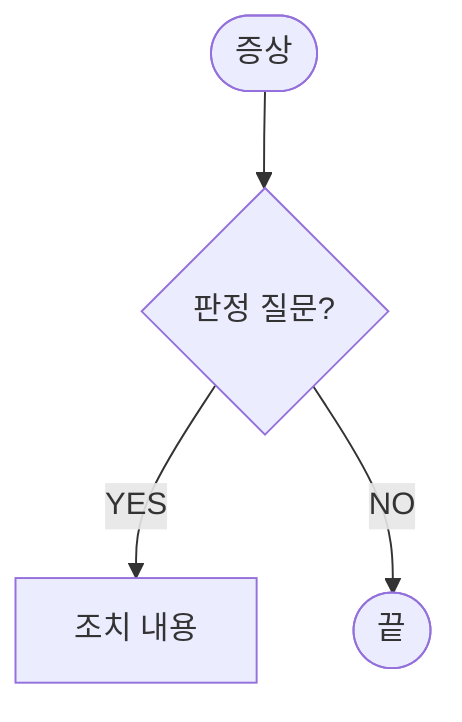

# 일신오토클레이브 기술자료 사이트

ISOSTATIC PRESS 기술자료 사이트. [VitePress](https://vitepress.dev/) 기반이며 GitHub Pages로 자동 배포됩니다.

공개 주소: https://ilshinautoclave.github.io/CIP/

## 로컬에서 실행

```bash
npm install
npm run docs:dev      # http://localhost:5173/CIP/
```

## 빌드

```bash
npm run docs:build    # docs/.vitepress/dist 생성
npm run docs:preview  # 빌드 결과 미리보기
```

## 배포

`main` 브랜치에 push하면 `.github/workflows/deploy.yml`이 자동으로 빌드·배포합니다.

**최초 1회 설정**: GitHub 저장소 → Settings → Pages → Source를 **GitHub Actions**로 변경하십시오.

## 폴더 구조

```
docs/
├─ index.md                  홈 (히어로 + 기능 카드)
├─ .vitepress/
│  ├─ config.mts             메뉴·사이드바·검색 설정
│  └─ theme/                 브랜드 색상, 커스텀 CSS
├─ public/
│  ├─ logo.png               헤더 로고
│  └─ images/                본문 이미지 (HMI, P&ID, 장비 사진)
├─ manual/                   매뉴얼 (7개 장 + 부록)
│  ├─ intro/                 1. 사용자를 위한 중요 정보
│  ├─ safety/                2. 안전
│  ├─ installation/          3. 설치
│  ├─ components/            4. 장치 구성
│  ├─ operation/             5. 운전
│  ├─ hmi/                   6. HMI 화면
│  ├─ maintenance/           7. 유지 보수
│  └─ appendix/              부록
├─ troubleshooting/          자가 진단 가이드 (플로차트)
├─ technical/                기술 문서 (알람 코드, 인터록, 부품)
└─ download/                 다운로드 (고객정보 입력 후 다운로드)
download-gate/               다운로드 고객정보 수집 서버 코드 + 설정 가이드
```

## 페이지 추가하는 법

1. 해당 폴더에 `.md` 파일을 만듭니다.
2. `docs/.vitepress/config.mts`의 `sidebar`에 항목을 추가합니다.

```ts
{ text: '5.8 새 항목', link: '/manual/operation/new-page' }
```

## 자가 진단 플로차트 작성

[Mermaid](https://mermaid.js.org/) 문법을 사용합니다.

````md

````

기존 페이지(`docs/troubleshooting/pressure-build.md`)의 스타일 클래스를 복사해 쓰면 색상이 통일됩니다.

## 안내 박스

```md
::: danger 위험
사망·중상 위험
:::

::: warning 경고 / 주의
부상·장비 손상 위험
:::

::: tip NOTE
참고 정보
:::

::: info 정보
부가 설명
:::
```

## 보완이 필요한 페이지

아래 페이지에는 `작성 예정` / `보완 필요` 안내가 표시되어 있습니다. 자료 확보 후 채워 주십시오.

- `technical/alarm-code-table.md` — PLC 알람 코드 확정 필요
- `technical/parts-list.md` — Parts List 기준 P/N 입력 필요
- `troubleshooting/heater.md` — 실제 조치 이력 반영 (A형 전용)
- `troubleshooting/alarm-response.md` — 알람 명칭 확정
- `manual/maintenance/checklist.md` — 점검 주기 확정
- 다운로드 — 구글 시트 연동 설정 및 파일 등록 (`download-gate/SETUP.md` 참고)
