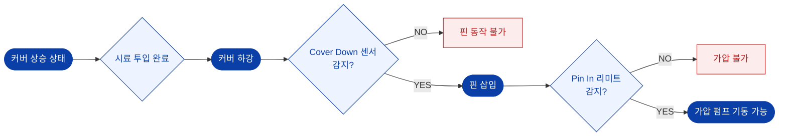

# 인터록 조건

장비의 안전은 **센서 연동(Interlock)** 으로 확보됩니다. 아래 조건이 충족되지 않으면 해당 동작은 실행되지 않습니다.

## 동작 허용 조건

## 인터록 표

| 동작 | 허용 조건 | 미충족 시 |
| --- | --- | --- |
| **핀 삽입** | 커버가 완전히 하강하여 실린더 측면 센서 감지 | 핀 동작 불가 |
| **가압 펌프 기동** | 커버 하강 램프 점등 **AND** 핀 삽입 램프 점등 | 펌프 기동 불가 |
| **핀 인출** | 베셀 압력 ≤ 설정 압력 | 핀 동작 불가 |
| **커버 상승/하강** | 베셀 압력 ≤ **커버 열림/닫힘 사용 압력** 설정값 | 커버 동작 불가 |
| **커버 조작 (버튼형)** | Cover-1 **AND** Cover-2 스위치 **동시** 조작 | 커버 동작 불가 |

::: danger
인터록은 **안전 장치**입니다. 임의로 우회하거나 센서를 강제 감지시키지 마십시오.
커버가 압력에 의해 이탈되면 **중대 인명사고**가 발생합니다.
:::

## 자동 에어 차단

각 동작은 완료 센서가 감지되면 **자동으로 에어가 차단**됩니다.

| 동작 | 완료 센서 | 차단 대상 |
| --- | --- | --- |
| 커버 하강 | Cover Down 센서 | 커버 실린더 에어 |
| 커버 상승 | Cover Up 센서 | 커버 실린더 에어 |
| 핀 삽입 | Pin In 리미트 스위치 | 핀 실린더 에어 |
| 핀 인출 | Pin Out 리미트 스위치 | 핀 실린더 에어 |

## 센서 위치

| 센서 | 위치 |
| --- | --- |
| Air cylinder position sensor | 커버·핀 이동 실린더 |
| Pin In limit switch | 핀 실린더 삽입 측 |
| Pin Out limit switch | 핀 실린더 인출 측 |
| Cover Down 센서 | 커버 실린더 측면 |

## 인터록 이상 시

| 증상 | 확인 | 조치 |
| --- | --- | --- |
| 커버가 내려갔는데 램프 미점등 | 센서 위치·배선 | 센서 위치 교정 (전문가) |
| 핀이 삽입됐는데 램프 미점등 | 리미트 스위치 | 스위치 동작 확인 후 교정 |
| 램프는 점등되나 펌프 미기동 | E.M.O STOP, 알람 | 비상정지 복귀, 알람 해제 |
| 압력이 0인데 커버 조작 불가 | 영점, 커버 사용 압력 설정 | 영점 조정, 설정값 확인 |

관련 → [승압·유지 불량](/troubleshooting/pressure-build) · [4.1 주요 구성품](/manual/components/parts)
