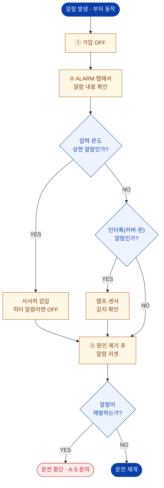

# 알람 발생 시 조치

::: info 보완 필요
알람 명칭과 코드는 **PLC 프로그램 기준으로 확정**해야 합니다.
현재 표는 HMI 설정 항목에서 유추한 초안이며, [알람 코드표](/technical/alarm-code-table)와 함께 보완해 주십시오.
:::

## 알람 발생 시 기본 대응 순서

::: danger
알람이 **반복해서 재발**하는 경우 임의로 리셋하고 운전을 계속하지 마십시오.
과압·과열 보호가 동작한 것일 수 있으며, 무시하고 운전하면 **압력용기 파열 또는 화재**로 이어질 수 있습니다.
:::

## 주요 알람과 1차 조치

| 알람 | 의미 | 1차 조치 | 관련 페이지 |
| --- | --- | --- | --- |
| 베셀 상한 압력 | 설정 압력 초과 | 가압 OFF → 서서히 감압 | [6.2 설정](/manual/hmi/alarm-setting) |
| 베셀 상한 온도 | 베셀 물 온도 초과 | 히터 OFF → 자연 냉각 | [히터 온도 이상](./heater) |
| 히터 상한 온도 | 히터 온도 초과 | 히터 OFF → 센서 점검 | [히터 온도 이상](./heater) |
| 커버 미하강 | 커버 하강 센서 미감지 | 커버 재하강, 센서 확인 | [커버 불량](./cover-movement) |
| 핀 미삽입 | 핀 삽입 센서 미감지 | 핀 재삽입, 리미트 확인 | [핀 고착](./pin-stuck) |
| 압력 미상승 | 일정 시간 내 승압 실패 | 물·에어·누수 확인 | [승압 불량](./pressure-build) |

## 부저

- 부저 동작 시간은 **SET 화면 › 부저 동작 시간**에서 설정합니다.
- 부저는 알람 상황을 알리는 것이므로, **부저만 끄고 운전을 계속하지 마십시오.**

## 비상 정지 (E.M.O STOP)

::: danger
비상 정지 버튼을 누르면 펌프 구동 에어가 차단됩니다.
**단, 베셀 내부의 압력은 그대로 유지됩니다.**
비상 정지 후에도 반드시 **Release valve로 감압**한 뒤 커버·핀을 조작하십시오.
:::

| 상황 | 조치 |
| --- | --- |
| 인명 위험 감지 | 즉시 E.M.O STOP |
| 고압 누수 발견 | 즉시 E.M.O STOP → 안전거리 확보 → 감압 |
| 이상 소음·진동 | 즉시 E.M.O STOP → 원인 확인 |

해결되지 않으면 → [A/S 요청 정보](./#a-s-요청-시-준비-정보)
