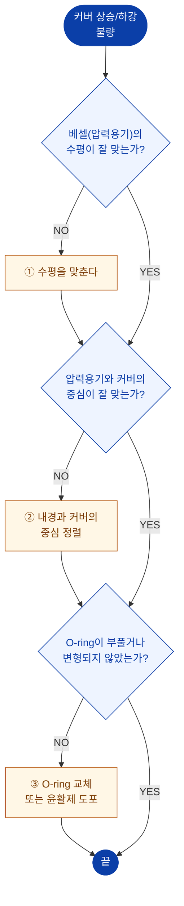

# 커버 상승/하강 불량

> 원 매뉴얼 **3.1 베셀 커버가 상승/하강이 원활하지 않은 경우**

::: warning 점검 전
압력이 완전히 **0 (Zero)** 인지 확인하고, 커버 구동 에어를 차단한 후 점검하십시오.
:::

## 진단 플로차트

## 조치 상세

### 1. 베셀 수평 확인

1. 압력용기 **상부 플랜지 면**에 수평계를 올립니다.
2. 전후·좌우 두 방향 모두 확인합니다.
3. 수평이 맞지 않으면 장비 하부 레벨링 볼트로 조정합니다.

자세한 절차 → [3.2 설치 장소 및 수평](/manual/installation/leveling)

### 2. 압력용기와 커버 중심 맞추기

1. 커버를 **매우 천천히** 하강시키며 간섭 위치를 확인합니다.
2. 커버 리프팅 장치의 브래킷 체결부를 약간 이완시킵니다.
3. 압력용기 내경과 커버의 중심이 일치하도록 위치를 조정합니다.
4. 체결 후 커버를 다시 천천히 승강시켜 마찰이 없는지 확인합니다.

::: warning
커버와 압력용기는 **어떤 마찰이나 충돌도 없어야 합니다.**
:::

### 3. O-ring 점검 및 교체

| 확인 항목 | 이상 판정 |
| --- | --- |
| 부풀음(Swelling) | 원래 단면보다 굵어짐 |
| 변형 | 눌린 자국, 비틀림 |
| 경화 | 탄성 상실, 눌러도 복원되지 않음 |
| 손상 | 찢어짐, 찍힘, 이물 박힘 |

**조치**
- 이상이 있으면 **O-ring을 교체**합니다.
- 이상이 없으면 **윤활제를 도포**합니다.

::: tip
O-ring은 소모품입니다. 교체 주기는 사용 조건 및 주변 환경에 좌우되므로 **정기적으로 점검·교체**하십시오.
:::

## 그 외 확인할 점

| 원인 | 확인 | 조치 |
| --- | --- | --- |
| 에어 공급 압력 부족 | 0.6 MPa 미만 | 공급 압력 조정 |
| Speed Control Valve 조임 과다 | 승강이 지나치게 느림 | 밸브 열림량 조정 |
| 실린더 내부 누기 | 에어 새는 소리 | 실린더 씰 교체 (전문가) |
| Cover Stopper 간섭 | 스토퍼 위치 이탈 | 위치 재조정 |

해결되지 않으면 → [A/S 요청 정보](./#a-s-요청-시-준비-정보)
