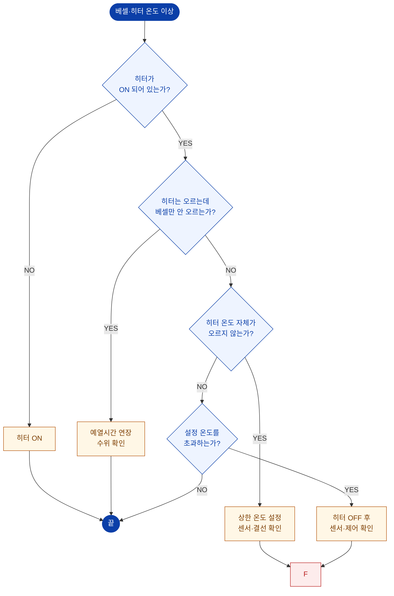

# 히터 온도 이상

::: info 보완 필요
히터는 **히터 탑재형(A형)** 에만 해당합니다.
이 페이지는 장비 구성에 근거해 작성한 초안입니다. **실제 알람 명칭과 조치 이력을 반영하여 보완**해 주십시오.
:::

## 진단 플로차트

::: danger 최대 운전 온도
히터 탑재형의 최대 운전 조건은 **600 MPa @ 85 ℃** 입니다.
베셀 온도가 **85 ℃를 초과하지 않도록** 상한 온도를 설정하십시오.
→ [6.2 알람 및 구동 설정](/manual/hmi/alarm-setting)
:::

## 온도 표시의 의미

| 표시 | 의미 |
| --- | --- |
| **베셀온도 PV** | 베셀 내부의 물 현재 온도 |
| **베셀온도 SV** | 베셀 목표 온도 |
| **히터온도 PV** | 실리콘 히터의 현재 온도 |
| **히터온도 SV** | 실리콘 히터의 목표 온도 |

::: tip
히터는 베셀 외벽을 가열하므로 **히터 온도가 베셀(물) 온도보다 먼저, 더 높게** 올라가는 것이 정상입니다.
베셀 온도가 목표에 도달하려면 **예열 시간**이 필요합니다.
:::

## 증상별 확인표

| 증상 | 확인 항목 | 조치 |
| --- | --- | --- |
| 히터·베셀 온도 모두 상승 없음 | 히터 ON 여부, 전원, 히터 결선 | 히터 ON / 결선 점검 (전문가) |
| 히터는 오르나 베셀이 안 오름 | 예열 시간, 물 수위 | 예열시간 연장, 수위 확인 |
| 온도가 설정값을 초과 | 온도 센서, 제어 출력 | 히터 OFF 후 센서 점검 (전문가) |
| 온도 표시가 튐 / 불안정 | 센서 배선, 접지, 노이즈 | 결선·접지 점검 (전문가) |
| 상한 온도 알람 발생 | 설정값, 실제 온도 | [알람 조치](./alarm-response) |

## 자가 조치 범위

| 항목 | 자가 조치 |
| --- | --- |
| 히터 ON/OFF, 설정 온도 변경 | ✅ |
| 예열 시간 조정 | ✅ |
| 물 수위 보충 | ✅ |
| 온도 센서 교체 | ❌ 제조사 문의 |
| 실리콘 히터 교체 | ❌ 제조사 문의 |
| 히터 제어 회로 점검 | ❌ 제조사 문의 |

해결되지 않으면 → [A/S 요청 정보](./#a-s-요청-시-준비-정보)
