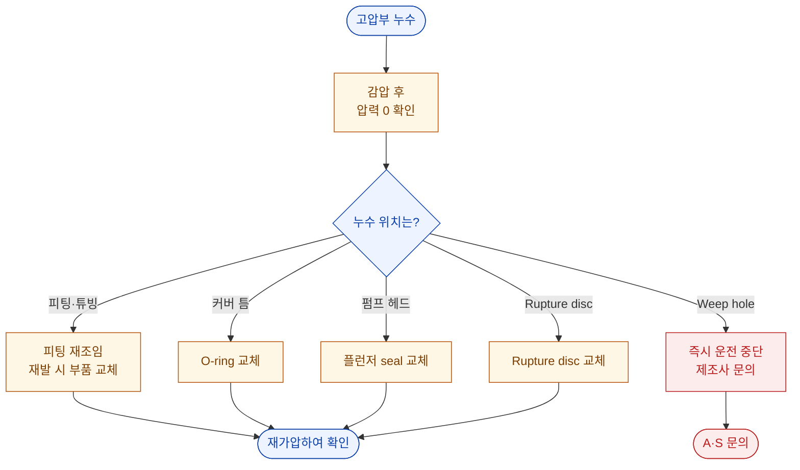

# 고압 누수 (Leak)

::: info 보완 필요
이 페이지는 원 매뉴얼 **3.4** 항의 누수 관련 내용을 분리·확장한 것입니다.
실제 현장 사례를 반영하여 내용을 보완해 주십시오.
:::

::: danger
**장비가 운전 중이거나 고압이 걸려 있을 때 피팅류나 연결부를 절대 조이지 마십시오.**
반드시 압력을 완전히 감압한 후 작업하십시오.
:::

## 진단 플로차트

## 누수 위치별 조치

| 위치 | 주요 원인 | 조치 | 자가 조치 |
| --- | --- | --- | --- |
| 피팅 / 튜빙 연결부 | 운송 중 이완, 반복 가압에 의한 이완 | 감압 후 재조임, 반복 시 Gland·Collar 교체 | ✅ |
| 압력용기 커버 틈 | O-ring 마모·변형 | O-ring 교체 | ✅ |
| 펌프 헤드 주변 | 플런저 seal 마모 | 플런저 seal 교체 | ⚠️ 숙련자 |
| Rupture disc 부위 | 과압으로 인한 파열 | 65,000 psi 규격으로 교체 | ✅ |
| **Weep hole** | **압력용기 이상 징후** | **즉시 운전 중단 → 제조사 문의** | ❌ |

::: danger Weep Hole 누수
Weep hole에서의 누수는 **압력용기 자체의 이상 징후**일 수 있습니다.
즉시 운전을 중단하고, 임의로 조치하지 말고 **제조사에 문의**하십시오.
또한 Weep hole로부터 손가락이나 손의 안전사고에 유의하십시오.
:::

## 누수 점검 요령

1. 압력을 **감압**하고 누수 의심 부위를 마른 천으로 완전히 닦습니다.
2. 낮은 압력(예: 500 ~ 1,000 bar)으로 가압합니다.
3. 안전거리를 유지한 채 각 부위를 육안으로 관찰합니다.
4. 물방울이 맺히는 위치를 기록합니다.

::: warning
고압 상태에서 누수 부위에 **손을 대지 마십시오.** 초고압 미세 분사는 피부를 관통할 수 있습니다.
:::

## 재조임 시 주의

| 항목 | 기준 |
| --- | --- |
| 작업 조건 | **압력 0 (Zero)** 상태 |
| 공구 | 규격에 맞는 스패너 사용 |
| 조임 | 과도한 조임 금지 — 나사산 손상 원인 |
| 반복 누수 | 재조임으로 해결되지 않으면 부품 교체 |

해결되지 않으면 → [A/S 요청 정보](./#a-s-요청-시-준비-정보)
