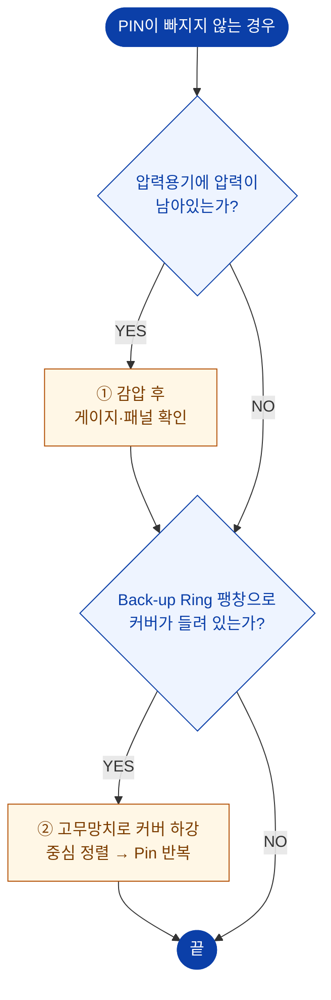

# 핀이 빠지지 않음

> 원 매뉴얼 **3.2 PIN이 빠지지 않는 경우**

::: danger 최우선 확인
**압력용기에 압력이 남아 있으면 절대 핀을 강제로 조작하지 마십시오.**
잔압 상태에서의 핀 조작은 커버가 튀어나가는 **중대 인명사고**로 이어집니다.
:::

## 진단 플로차트

## 조치 상세

### 1. 잔압 제거

1. **Release valve**를 매우 서서히 엽니다. (0.1 MPa/sec)
2. **Air vent valve**를 함께 열어 잔류압을 완전히 배출합니다.
3. **압력 게이지**와 **HMI 패널 표시 압력**을 **모두** 확인합니다.

::: warning
게이지와 HMI 표시가 다를 경우, **높은 쪽을 실제 압력으로 간주**하고 조치하십시오.
영점이 어긋났을 가능성이 있습니다. → [6.2 영점 조정](/manual/hmi/alarm-setting#영점-조정-압력-bias)
:::

### 2. Back-up Ring 팽창으로 커버가 들린 경우

핀이 빠지지 않는 가장 흔한 원인은 **커버가 압력용기보다 약 1 mm 이상 상승**해 있는 것입니다.

**조치 순서**

1. **고무망치**를 이용하여 커버의 상부를 **골고루** 때려서 커버를 원위치로 하강시킵니다. (약 1 mm)
   - 커버가 압력용기보다 약 1 mm 이상 상승되어 있으면 핀이 빠지는 데 장애가 될 수 있습니다.
2. **압력용기의 내경과 커버의 중심**을 맞춥니다.
3. **Pin In → Out → In** 을 **수초씩 반복**합니다.

::: tip NOTE
핀의 긁힘 방지를 위해 **이동 속도를 느리게 조절**해 두었습니다. 즉시 움직이지 않아도 정상이므로, 조급하게 반복 조작하지 마십시오.
:::

::: danger
- 금속 망치를 사용하지 마십시오. 반드시 **고무망치**를 사용합니다.
- 한 곳만 집중해서 때리지 말고 **골고루** 때려야 커버가 기울지 않습니다.
:::

## 그 외 확인할 점

| 원인 | 확인 | 조치 |
| --- | --- | --- |
| 핀 실린더 에어 부족 | 공급 압력 0.6 MPa 미만 | 에어 압력 조정 |
| 핀 표면 스크래치·이물 | 육안 확인 | 이물 제거, 윤활 |
| Pin Out 리미트 스위치 불량 | 인출해도 램프 미점등 | 센서 위치 교정 (전문가) |
| 커버 기울어짐 | 수평계 확인 | 중심 재조정 |

해결되지 않으면 → [A/S 요청 정보](./#a-s-요청-시-준비-정보)
