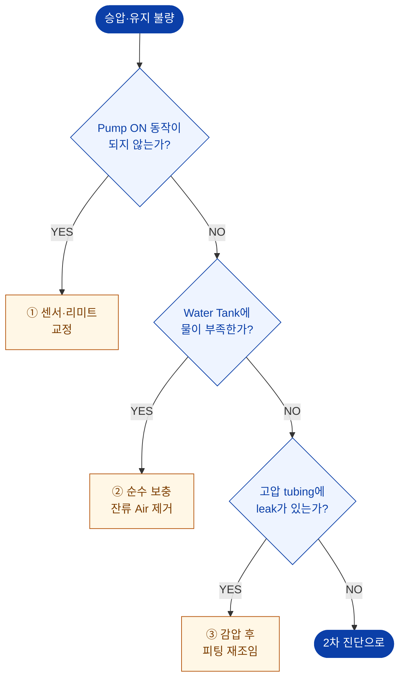
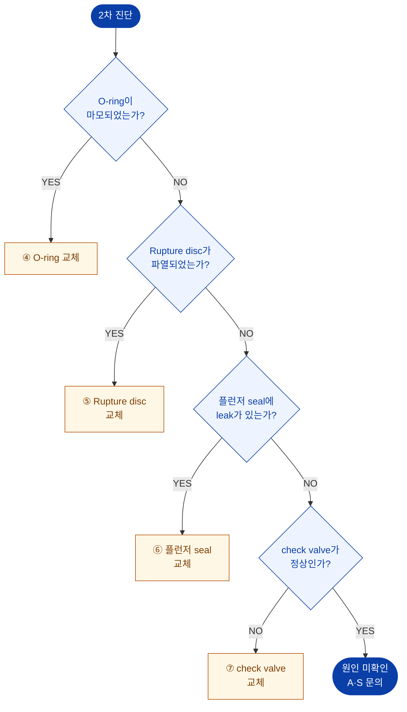

# 승압·유지 불량

> 원 매뉴얼 **3.4 압력의 승압 또는 유지가 안되는 경우**

가장 문의가 많은 증상입니다. **위에서부터 순서대로** 확인하십시오. 순서를 건너뛰면 원인을 놓치기 쉽습니다.

## 1차 진단 — 운전 조건

먼저 **인터록 · 물 · 누수**를 확인합니다. 여기서 대부분 해결됩니다.

## 2차 진단 — 부품 상태

1차에서 원인을 찾지 못하면 **소모품·밸브**를 순서대로 확인합니다.

::: tip
플로차트의 번호 ①~⑦은 아래 **조치 상세**의 항목 번호와 같습니다.
:::

## 조치 상세

### 1. 펌프가 아예 기동하지 않는 경우 — 인터록 확인

가압 펌프는 **커버 하강 + 핀 삽입**이 모두 감지되어야 기동합니다.

| 확인 | 정상 | 이상 시 조치 |
| --- | --- | --- |
| Cover Down Lamp | 점등 | 커버 재하강, 센서 위치 교정 |
| Pin In Lamp | 점등 | 핀 재삽입, 리미트 스위치 교정 |
| E.M.O STOP | 해제 | 비상정지 복귀 |
| 알람 | 없음 | [알람 조치](./alarm-response) |

**조치**: 핀 이동 실린더 센서 감지 확인 및 핀 삽입 감지, **리미트 센서 동작을 확인 후 교정**합니다.

→ 상세 인터록 조건: [기술 문서 › 인터록 조건](/technical/interlock)

### 2. 물 부족

1. **Water Tank의 수위**를 확인합니다. (운전 중 약 60 % 수준이 정상)
2. 부족하면 **순수(Pure Water)** 를 보충합니다. 초기 충전 시 90 % 이상.
3. **Pump head에 잔류 Air를 반드시 제거**합니다.

::: danger
반드시 **순수**를 사용하십시오. 수돗물·지하수는 스케일과 부식을 유발합니다.
:::

### 3. 고압 튜빙 누수

1. 압력을 **완전히 감압**합니다.
2. Fitting류를 다시 조여줍니다.

::: danger
**장비가 운전 중이거나 고압이 걸려 있을 때 피팅류나 연결부를 절대 조이지 마십시오.**
:::

누수 부위 판별은 [고압 누수(Leak)](./leak)를 참조하십시오.

### 4. 압력용기 O-ring 마모

O-ring이 마모되면 **압력은 상승 또는 유지될 수 없습니다.**

::: tip
이 O-ring은 **주기적으로 교체**해야 하고, 교체 주기는 **사용 조건 및 주변 환경에 좌우**됩니다.
:::

### 5. Rupture Disc 파열

과압이 발생하면 Rupture disc가 파열되어 압력을 방출합니다. 파열된 상태에서는 승압이 되지 않습니다.

| 항목 | 사양 |
| --- | --- |
| 규격 | **65,000 psi** |
| 판정 | 디스크 파열, 해당 부위에서 물이 계속 배출됨 |
| 조치 | 동일 규격 Rupture disc로 교체 |

::: danger
반드시 **65,000 psi 규격**으로 교체하십시오. 규격이 다른 디스크를 사용하면 과압 보호가 작동하지 않아 **압력용기 파열**로 이어질 수 있습니다.
:::

### 6. 가압펌프 플런저 Seal 누수

가압펌프의 **플런저 seal이 마모된 경우에는 승압 속도가 늦거나 승압 동작이 이루어지지 않습니다.**

| 증상 | 판정 |
| --- | --- |
| 펌프는 작동하나 압력이 거의 오르지 않음 | 플런저 seal 마모 의심 |
| 펌프 헤드 주변에서 물이 새어나옴 | 플런저 seal 누수 확정 |

**조치**: 가압펌프의 플런저 seal을 교체합니다. (숙련자 작업 권장)

### 7. Check Valve 이상

| 밸브 | 이상 시 증상 |
| --- | --- |
| **Inlet check valve** 불량 | **승압이 이루어지지 않음** |
| **Outlet check valve** 불량 | **압력의 유지가 이루어지지 않음** |

**조치**: 해당 check valve를 교체합니다.

::: tip 증상으로 구분하기
- 압력이 **처음부터 안 오른다** → Inlet check valve 의심
- 압력이 **올랐다가 계속 떨어진다** → Outlet check valve 의심
:::

## 증상별 우선 확인 순서

| 증상 | 1순위 | 2순위 | 3순위 |
| --- | --- | --- | --- |
| 펌프가 기동조차 안 함 | 인터록(커버·핀) | E.M.O STOP | 에어 공급 |
| 펌프는 도는데 압력 0 | 물 부족 / 잔류 에어 | Release·Vent 밸브 열림 | Inlet check valve |
| 압력이 천천히 오름 | 에어 유량(V-1) | 플런저 seal | 잔류 에어 |
| 압력이 올랐다가 떨어짐 | O-ring | Outlet check valve | 고압 누수 |
| 압력이 급격히 빠짐 | Rupture disc | 고압 튜빙 누수 | O-ring |

해결되지 않으면 → [A/S 요청 정보](./#a-s-요청-시-준비-정보)
