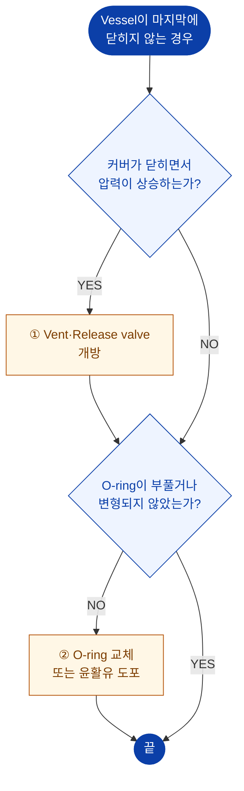

# 베셀이 닫히지 않음

> 원 매뉴얼 **3.3 Vessel이 마지막에 닫히지 않는 경우**

커버가 마지막 구간에서 더 이상 내려가지 않는 증상입니다. 대부분 **베셀 내부 공기가 압축되어 반발**하거나 **O-ring이 변형**된 것이 원인입니다.

## 진단 플로차트

## 조치 상세

### 1. 내부 압력 상승 방지

커버가 하강하면서 베셀 내부의 물과 공기가 압축되면 **반발력**이 생겨 커버가 끝까지 내려가지 않습니다.

**조치**

1. **Air vent valve**를 엽니다.
2. **Release valve**를 엽니다.
3. 이 상태에서 커버를 다시 천천히 하강시킵니다.
4. 커버 하강 완료 후, 가압 전에 두 밸브를 다시 **완전히 닫습니다.**

::: warning 잊지 마십시오
커버가 닫힌 뒤 **Release valve와 Air vent valve를 다시 닫지 않으면 가압이 되지 않습니다.**
→ [5.5 가압](/manual/operation/pressurizing)
:::

### 2. O-ring 점검

| 확인 항목 | 이상 판정 | 조치 |
| --- | --- | --- |
| 부풀음 | 단면이 굵어짐 | 교체 |
| 변형 | 눌린 자국, 비틀림 | 교체 |
| 경화 | 탄성 상실 | 교체 |
| 건조 | 윤활 부족으로 뻑뻑함 | 윤활유 도포 |

## 그 외 확인할 점

| 원인 | 확인 | 조치 |
| --- | --- | --- |
| 물 과충전 | 탱크 수위가 과도 | 적정 수위(초기 90 %, 운전 중 약 60 %)로 조정 |
| 베셀 내 이물질 | 몰드 파편, 이물 | 내부 청소 |
| 수평 불량 | 수평계 확인 | [수평 재조정](/manual/installation/leveling) |
| 커버 중심 불일치 | 마찰음 발생 | 중심 재조정 |

해결되지 않으면 → [A/S 요청 정보](./#a-s-요청-시-준비-정보)
